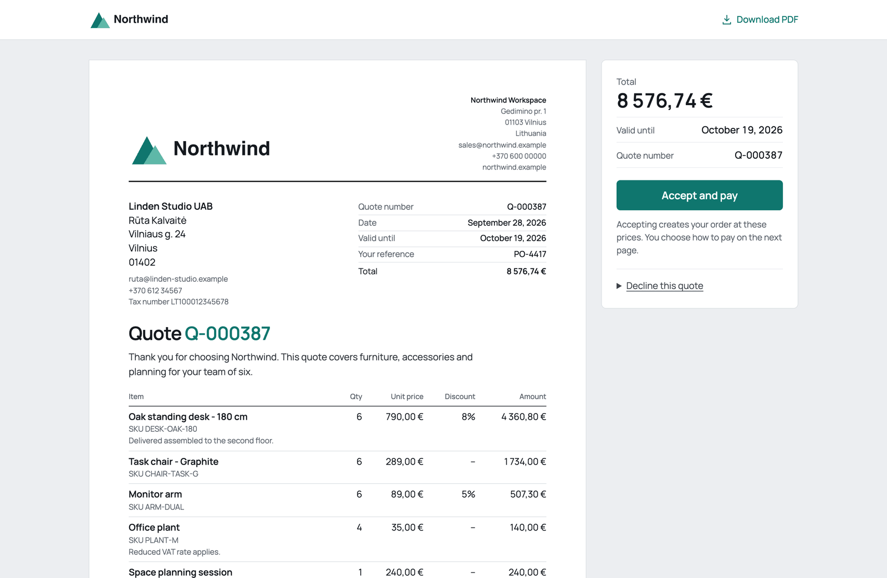
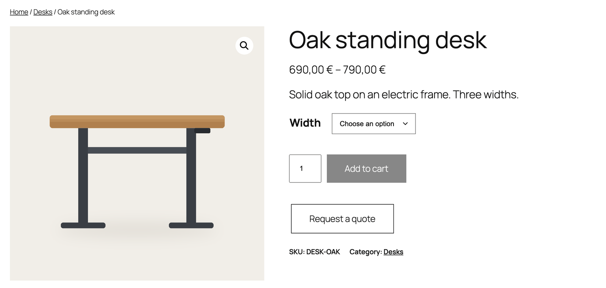
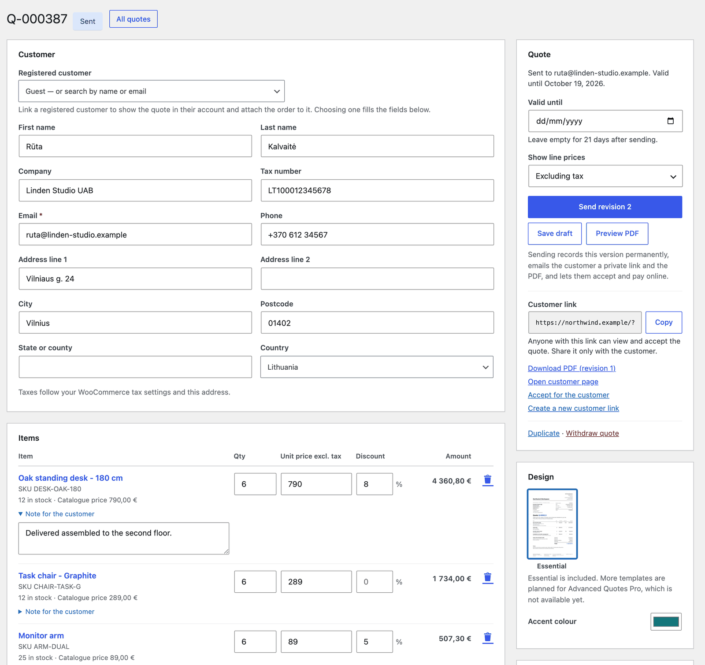
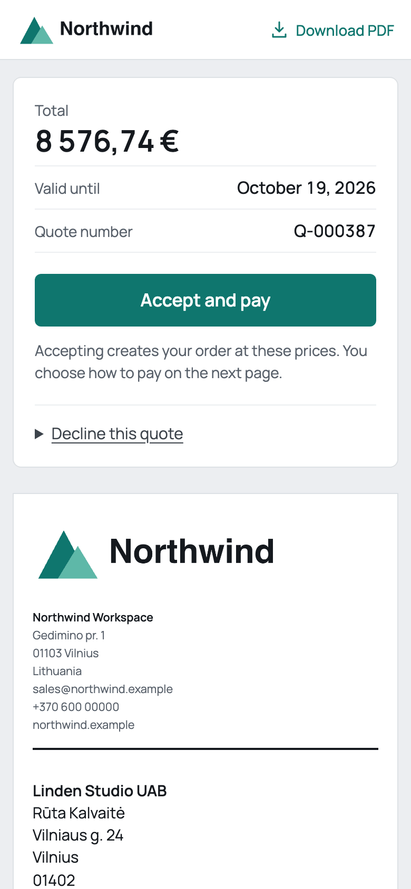
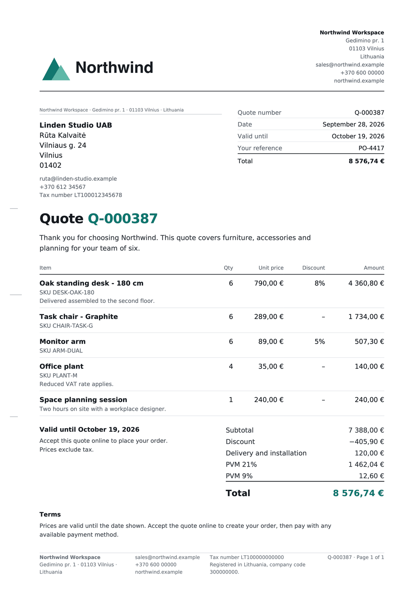

# Advanced Quotes for WooCommerce

Let customers ask for a price, send them a quote, and get paid when they accept.

**[Download the latest version](https://github.com/we-wp/advanced-quotes-for-woocommerce/releases/latest)** · [Plugin page](https://we-wp.com/plugins/advanced-quotes-for-woocommerce)

## How it works

**1. A customer asks for a price.** A Request a quote button sits next to Add to cart, and in the cart.

**2. You set the prices.** Open the request, adjust quantities and prices, add a discount or shipping, and send it. Totals follow your WooCommerce tax settings.

**3. They accept and pay.** Your customer gets a PDF and a private link. Accept and pay creates the order at your prices and opens checkout.

  
  &nbsp;
  

## What you get

- A Request a quote button on product pages and in the cart
- Your own questions on the request form, such as a deadline, budget or measurements
- A quote generator with discounts, custom items and shipping
- PDF quotes with your logo and colour
- A page where customers accept, decline or download their quote
- An email at every step
- No limit on quotes

## Install

1. Download `advanced-quotes-for-woocommerce-0.2.0.zip` from the [latest release](https://github.com/we-wp/advanced-quotes-for-woocommerce/releases/latest). The Source code files won't install.
2. In WordPress, go to **Plugins → Add New Plugin → Upload Plugin**, then install and activate it.
3. Open **WooCommerce → Settings → Quotes** to add your business details and logo.

You need WordPress 7.0+, WooCommerce 11.1+ and PHP 8.3+.

## Help

Questions or problems? [Open an issue](https://github.com/we-wp/advanced-quotes-for-woocommerce/issues). Found a security problem? [Report it privately](https://github.com/we-wp/advanced-quotes-for-woocommerce/security/advisories/new).

## For developers

`python3 tools/build.py` builds the installer. [CONTRIBUTING.md](CONTRIBUTING.md) explains how to test a change, and [QA.md](QA.md) lists what was tested.

---

Made by [we-wp](https://we-wp.com) · UAB BusinessPress · GPL-3.0-or-later. WooCommerce is a trademark of Automattic Inc. This plugin is not endorsed by Automattic.
